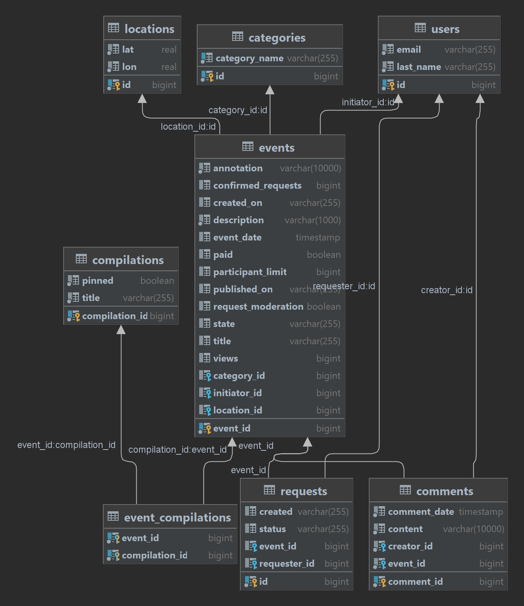

# java-explore-with-me

The application allows you to share information about interesting events and help you find a company to participate in them.

* For unauthorized users are available:

-search for events with specific user criteria;

-event search by id.

* The following functionality is available for an authorized user:

-event placement, editing and cancellation;

-placing an application for participation in an event posted by another user;

-various types of search, including search for events created by this user, search for applications left by him;

-adding comments for past events (if an application was required to participate in the event, then only the user whose application was confirmed can leave a comment),

-editing and deleting them by the author;

-adding questions to an event that has not yet taken place (only the organizer can answer the question), deleting questions;

-appeals to the administrator (currently, calls are provided for deleting individual entities; the user cannot delete the appeal, only close it);
and etc.

* The administrator can perform the following actions in the application:

-create users;

-publish, edit and reject events;

-search by users, events, calls to it;

-create, edit and delete categories and collections of events;

-pin and unpin event collections;

-delete individual entities;

-approve and reject user requests.

* The application consists of two modules:

-service;

-statistics.

The first one implements all the business logic of the application, the second collects and returns statistics.

At the moment, information about calls to public methods gets into the statistics.

The project is a thesis at the Yandex.Practice.Java-developer course.
